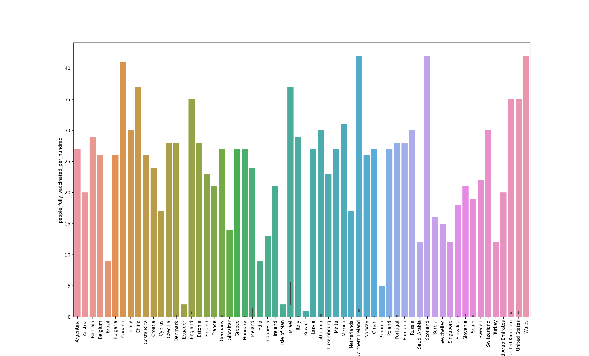
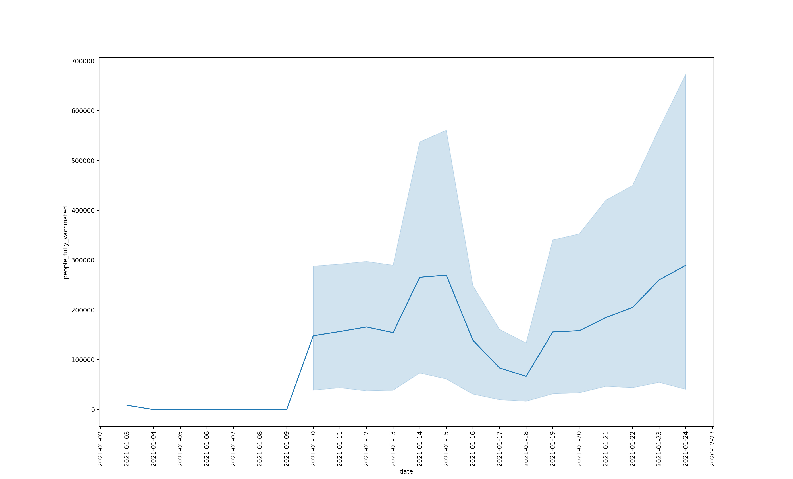
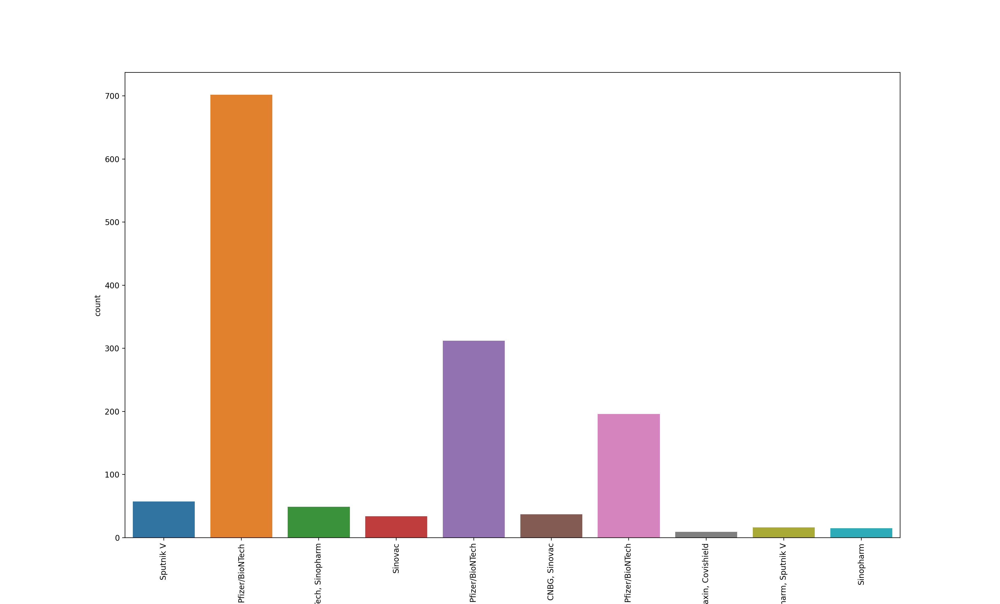

# Data

In this lab, I worked with the country vaccinations dataset, which outlined the number of vaccinations, the proportion of people vaccianted, and the type of vaccine in each country. In a time when COVID-19 wreaks havoc across the globe, understanding quantitative information surrounding the COVID-19 vaccinations is more important than ever before. Let's dive into the data to draw conclusions about current vaccinations.

# Code

    import pandas as pd
    import matplotlib.pyplot as plt
    import seaborn as sns

    cv_path = "../sandbox/country_vaccinations.csv"
    country_vaccinations_df = pd.read_csv(cv_path)

    cv_path = country_vaccinations_df

    #Group by country to find total values for each country
    cv_path.groupby(['country']).sum()
    graph1 = sns.countplot(x="country", data=cv_path)
    plt.xticks(rotation=90)
    plt.show()
    graph2 = ax = sns.barplot(x="country", y="people_fully_vaccinated_per_hundred", data=cv_path)
    plt.xticks(rotation=90)
    plt.show()

    #Group by date to find total values for each date
    cv_path.groupby(['date']).sum()
    graph3 = sns.lineplot(data=cv_path, x="date", y="people_fully_vaccinated")
    plt.xticks(rotation=90)
    plt.show()

    #Group by vaccine to find total values for each vaccine
    cv_path.groupby(['vaccines']).sum()
    graph4 = sns.countplot(x="vaccines", data=cv_path)
    plt.xticks(rotation=90)
    plt.show()

# Methods

In my analysis, I looked at five different variables: country, date, people_fully_vaccianted_per_hundred, people_fully_vaccinated, and vaccine. There were several different conclusions to draw, so I had to determine the most important information in this dataset. I set out to answer three questions... Which countries have implemented the vaccine most effectively? What is the trend of the number of vaccines used each day? What is the most common type of vaccine used? I decided to use a variety of visualizations to answer these questions, ranging from countplots to lineplots. Let's see what I found out!

# Conclusions

To determining which countries are most represented in the data set, I used a simple countplot:

Using the graph above, I can see that Wales, Scotland, Northern Ireland, and Canada appear most frequently in the dataset. While this is useful information, it does not tell me much about the actual important information in the dataset. So let's look at the countries that have the highest proportion of fully vaccinated people. To do this, I used the "group by" function on the 'country' variable, and I found the following graph:

We can find that these four countries also lead in percentage of people fully vaccinated, so they seem to have been dealing with vaccinations best out of all the countries on this dataset.

To answer the question about the general trend, I grouped by date to figure out the dates on which the most COVID-19 vaccines have been handed out. I used the lineplot below:

Based on the lineplot, we can see that there have been more people fully vaccinated on almost every subsequent day. This is a positive sign for the future, as it shows that vaccines are rising at an exponential rate. That said, there is still quite a way to go, as no country has vaccinated over 50 percent of its population.

To answer the final question, we can look at a simple countplot of vaccines after grouping by vaccines. Let's find out which vaccines are most commonly used.

We now can see that the most common vaccine is Pfizer/BioNTech. Although this might not be the most helpful information for us, it surely could play an important role for those involved in medical fields.

Overall, this was a very interesting and productive dataset to analyze, and I learned a lot about dataframes in the process.