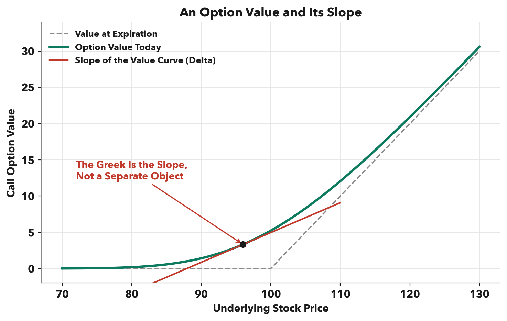
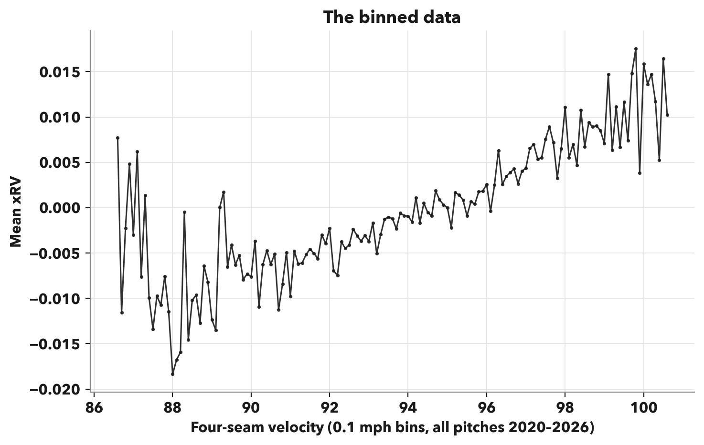
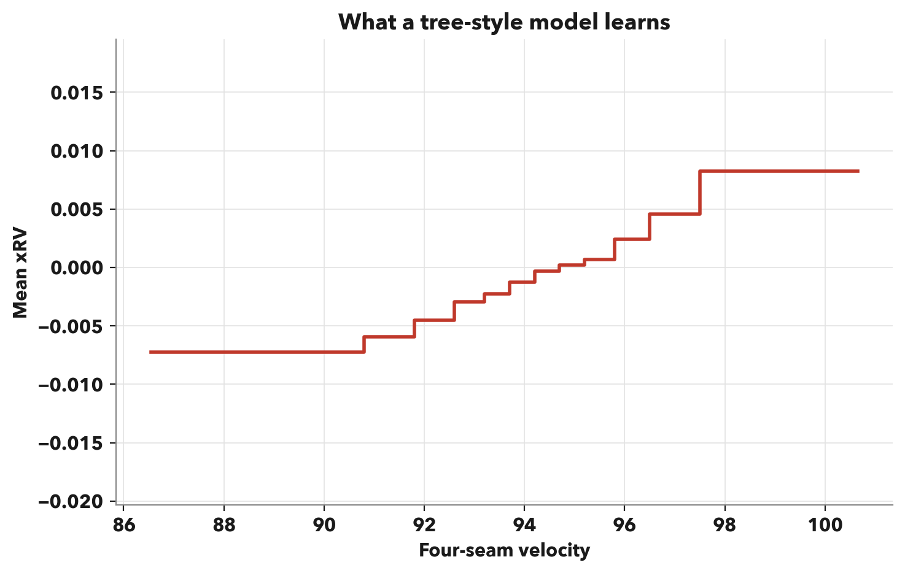
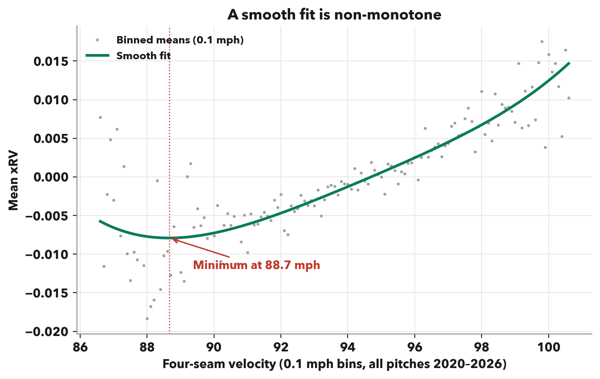
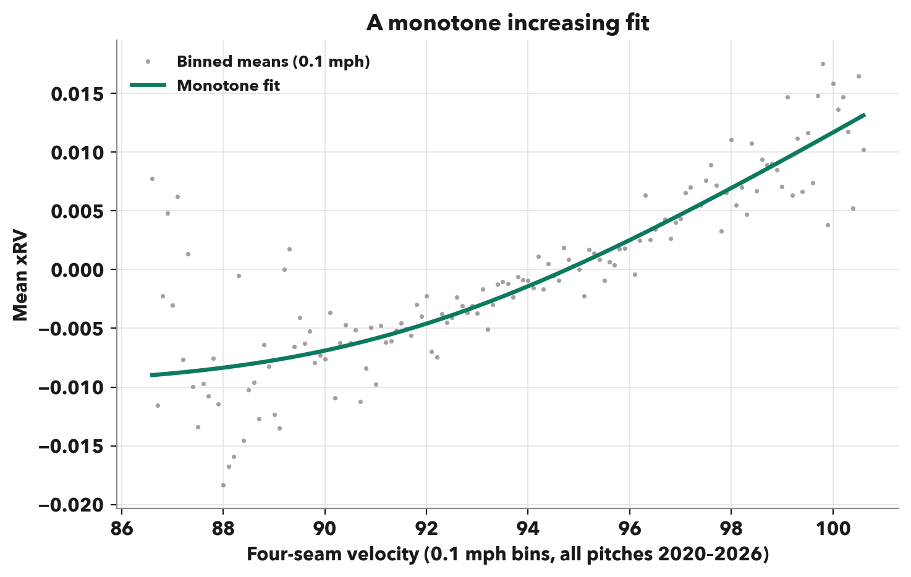
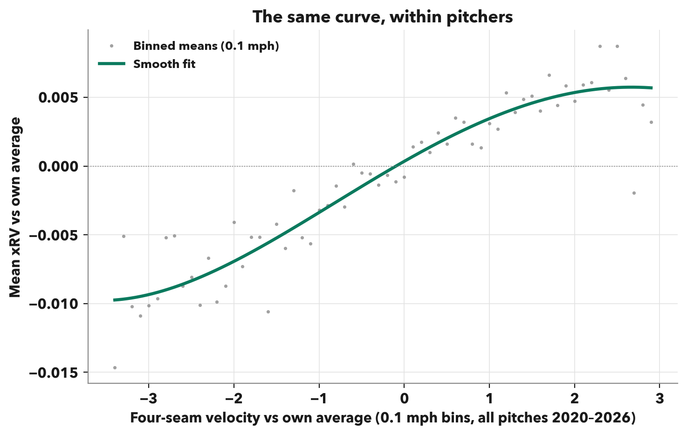
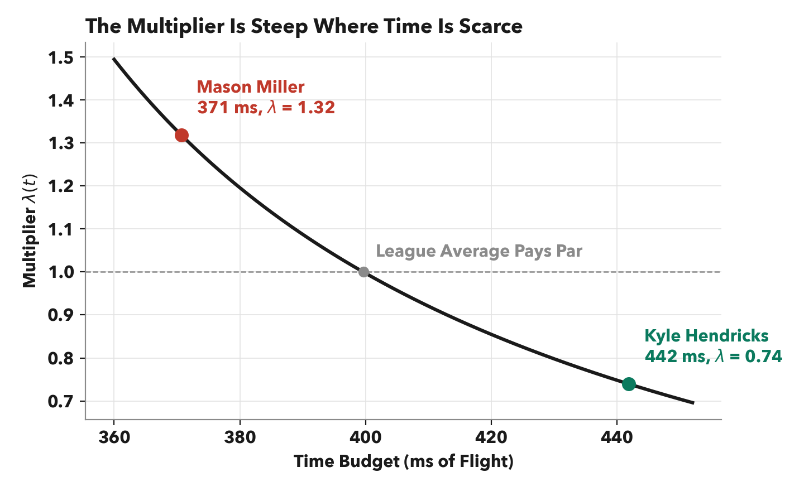
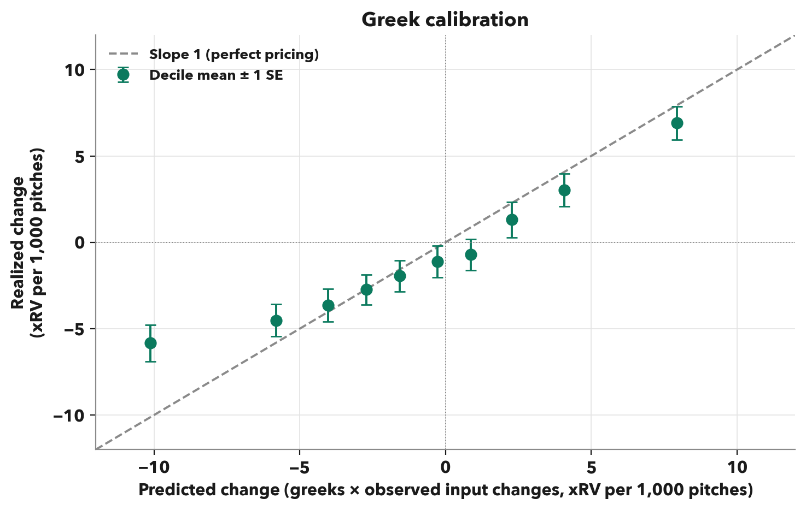

## 1. Introduction

This paper begins a long way from the pitcher's mound, in the world of financial options. At the heart of every option is a single number: the theoretical value. Set against a price, that value defines the theoretical edge of an options trade.

That value, however, is merely a pricing model's snapshot of a dynamic world. Take the Black-Scholes option valuation model as an example. The Black-Scholes model receives five inputs—the underlying stock price, the option's strike price, volatility, time to expiration, and the risk-free interest rate—and returns a single valuation. The strike price, the price at which the underlying stock can be transacted at expiration, remains constant. The other four inputs move all the time, and the option's value moves with them. A valuation computed at any point in time can, and in many cases will, be stale by the time you blink—not because the model changed, but because the world did.

Every trade is a doorway into a hallway of rooms, one for each state the world might take next. The underlying gaps in one room, volatility reprices in another, and a day passes quietly in another. You eventually will find yourself standing in exactly one of the rooms—but you don't choose which, and you can leave only at whatever price the room demands.

The windows into the rooms are the greeks, offering visibility into how options perform in each state of the world—the room where the underlying gaps (delta), where volatility jumps (vega), where a day passes (theta), where rates move (rho). Formally, the greeks are the derivatives of an option price with respect to each dynamic input.

Baseball is full of pricing models. A stuff model is a pricing model in every sense. It receives a handful of inputs—velocity, movement, release point—and returns a single number: the stuff grade, a currency that has grown relevant over the rise of the analytics revolution. It is a theoretical value in its purest form.

And pitchers are among the most dynamic worlds in sports. Velocity rises and falls with the standard aging curve. Movement can vary drastically across pitch grips. Modern development labs and optimization methods can manufacture state changes. And in a baseball market that has grown efficient in pricing levels but lacks visibility into state changes, greeks are the residual edge.

But here is the key point about greeks: you cannot build them directly. A greek is not a freestanding object you estimate on its own; it is the slope of a well-defined surface.

The well-defined surface arrives cleanly in the Black-Scholes model. It is a closed-form solution to a differential equation derived from first principles—such as the log-normal distribution of the underlying stock and the impossibility of market arbitrage—without consulting market data. In baseball, however, first principles are less obvious. There is no equation for a fastball, no law that says how a pitch's value must respond to velocity, and no theory that removes any outcome from the realm of possibility.

The natural alternative is to let the data—millions of points with dozens of relevant variables—fit your shapes. In fact, the field consensus is to use the most flexible models available, gradient-boosted trees and neural networks, to learn the complex observed relationships between inputs and outputs.

My contention is this: while baseball carries no first principles as strikingly obvious as "there should be no riskless profit opportunities," baseball does have first principles for what must be smooth, what causes what, and how much information it takes to describe a ball in flight. The optimal modeling approach is to force the surface to obey these principles *before* the data weighs in. The alternative, drawing shapes with data that is noisy, high-dimensional, and absolutely riddled with survivorship bias is the fundamental reason why models that optimize for flexibility fail to produce intelligent causal relationships and thus, intelligent greeks. And a model that fails to produce intelligent greeks can only ever be validated in snapshots the world has already taken. Everywhere else, its prices are carried by its slopes, and its slopes are exactly what it was never built to get right. The rest of this paper builds the surface the other way around: principles first.

## 2. First Principles

### 2.1 Shape

We start with shape. Before a single pitch is observed, physics already constrains the relationship between a pitch's characteristics and its value. A model that ignores those constraints is ultimately susceptible to learning violations of them.

There are two primary constraints. The first is smoothness: the effectiveness of a pitch should have a smooth relationship with velocity and movement. Consider the following defense. Let's convert velocity to allotted reaction time, as distance divided by velocity. Even in an extreme case where the outcome function carries a genuine discontinuity—say each hitter has a fixed reaction time such that every pitch granting him at least $x$ seconds results in a home run, and all other pitches result in a whiff—the value of $x$ can be assumed to vary smoothly from hitter to hitter because the league-wide distribution of hitter ability is smooth by any reasonable measure. Expected outcomes as a function of true velocity are therefore a binary function averaged over the smooth distribution of $x$, which generates a smooth curve, even in this worst-case toy example.

Despite its logic-driven foundation, the smoothness principle is not obeyed by most standard modeling approaches. Take the most fundamental relationship in stuff modeling: four-seam fastball outcomes as a function of velocity. Blind to first principles, a model may learn the relationship as plotted below, with outcomes—or in the case of a batted ball, physics-expected outcomes—expressed as pitcher-oriented game-state-independent expected run value (xRV), and velocity binned in 0.1 mph buckets.

The general trend appears to be reasonable: velocity is positively correlated with pitcher-oriented pitch outcomes. A magnifying glass, however, would see a train headed off the rails. Adjacent bins routinely suggest that local velocity decreases yield improved results—in greek terms, a negative velocity greek. In fact, the sign of the derivative flips across adjacent points 69 percent of the time, more than the expectation of a random walk.

This granularity is what an ultra-flexible model is trained to master. A neural network, for example, may not smooth the wiggles away; instead, it may learn them. The result technically would be a differentiable curve, but its derivative is the derivative of noise, unless there are physics-driven reasons why 99.9 mph four-seamers perform notably worse than 99.8 mph fastballs. An alternative model, such as a gradient-boosted tree model, may learn to remove some of these wiggles, but it imposes other unwanted behavior. A tree carves velocity into leaves and returns a constant output inside each one. The result may resemble the plot below.

This function implies that the output gain from 86.6 mph to 90.8 mph is zero, and the output gain from 97.5 mph to 100.6 mph is also zero, but the output gain from 97.4 mph to 97.5 mph is about 3.7 runs per 1,000 pitches. Read through the lens of greeks, the tree-based model is nonsensical for an entirely different reason than the neural network. At every point, the derivative of the staircase function is either zero or undefined.

Both these models trace the data faithfully, but neither has the logic-driven smoothness to answer the question a greek exists to answer—what is the price of a tick of velocity or an inch of break? But what if a non-smooth model could regain smoothness post-fit? A tempting move is a finite difference: nudge the input by a small step $h$ and read the slope off the fitted surface as $\frac{f(x+h)-f(x)}{h}$. The trouble is in the arithmetic. The true change in value across a small step is proportional to $h$. It shrinks as the step shrinks, but the noise in the surface evaluations does not. A flexible fit can misread the surface by $\varepsilon$ at both points, in opposite directions, no matter how close they sit. Therefore, the numerator carries error of up to $2\varepsilon$ against a signal of size roughly $f'(x) \cdot h$. Dividing by $h$ turns bounded noise in the surface into noise of size $\frac{2\varepsilon}{h}$ in the estimated greek. Increasing $h$ shrinks the noise bound, but only by changing the question: the quotient would simply estimate the average greek over an arbitrary window. A finite difference is inherently a division by a small number, and it amplifies exactly what a flexible fit oversupplies: noise. Ultimately, a smoothness assumption invoked after the fit to rescue the derivative is an admission that it belonged in the fit all along.

The second constraint within the smoothness principle is direction. For certain inputs, physics implies some truth about the directionality of their relationship with outcomes. Velocity is the cleanest case. All else constant, more velocity implies a smaller time budget for the hitter, forcing him to commit to a swing with less of the pitch trajectory observed. Since information ahead of an irreversible decision can only help the hitter, it can be safely assumed that pitcher outcomes monotonically decrease with allotted time budget, and thus monotonically increase with velocity. One could counter by arguing that hitting is a timing game and slower pitches, especially those of non-fastball types, can disrupt timing. My response is that this argument pertains to a different variable: the difference between arrival and expected arrival. Expectation is a property of the arsenal, not the pitch. This modeling framework evaluates pitches independently of the rest of the arsenal.

Let's return to the binned plot, only now after obeying the smoothness principle.

Here, it is clear that the best-fit curve does not obey the velocity monotonicity principle, as a trough at 88.7 mph implies that pitchers can expect better results throwing, say, 88 mph than throwing 88.7 mph. We will dive into why this occurs and how to combat it in the next section, but our first-principle-oriented approach would strongly recommend a monotonicity constraint, even if the monotonic curve—such as the one below—hugs the data points a bit less closely.

The broader principle is this: wherever physics suggests some truth about the direction of the relationship between a variable and performance, the model should seek a shape that respects that truth. The job of the data is to set the magnitude of a sensitivity, not to autonomously determine its direction. Not every input earns such a constraint, but where the directional argument exists, imposing it buys a guarantee of the same kind smoothness bought: a greek that not only exists everywhere but can never point the wrong way. A model left free to discover that velocity hurts is not more open-minded. It is one misleading neighborhood of data away from pricing a tick of velocity as a penalty, defying fundamental first principles of baseball.

### 2.2 Identification

The second principle is identification. A greek is a statement about a counterfactual: what would happen to a pitch's outcomes if one of its characteristics changed, all else fixed. The data, however, contains no such counterfactuals; instead, it contains comparisons mostly between pitchers.

Comparisons between pitchers are contaminated by survivorship. Every pitch in the dataset passed through a filter—belonging to a pitcher who earned a major-league roster spot—and that filter is not independent of the inputs a stuff model cares about. A pitcher who sits 97 mph can be ordinary in every other respect and remain in the sample; by contrast, a pitcher who sits 88 survives only if other skills sufficiently compensate.

Selection manufactures a correlation in the observed data between low velocity and high skill elsewhere. Take a simplified example, in which pitchers can survive only with high velocity or high skill in some other dimension—say, command or sequencing. The low-velocity pitchers who survive in the sample are thus more likely to carry compensating skills elsewhere, establishing negative correlations that exist in sample but not in nature. A model fit across pitchers inherits these relationships: credit for the survivors' compensating skills leaks into the price of their velocity.

We have already seen this effect hard at work. Recall the trough at 88.7 mph in the smooth velocity fit. This is not a claim that a pitcher, all else equal, is better off at sub-88.7-mph velocities than at 88.7 mph. Rather, it's a claim that 88.7 mph four-seam fastballs perform worse than their leftward neighbors. Why? Below 88.7 mph, survival demands ever more compensation, so in-sample four-seams carry ever more hidden skill.

The data can check this. If the trough reflected some physical truth about a non-monotonic relationship between velocity and outcomes, it would appear in within-pitcher relationships. If instead the trough is manufactured by selection, it would live entirely in the comparison between pitchers. The test is to measure every pitch's velocity against its own pitcher's average, and its outcome likewise.

Across 1.4 million four-seam fastballs from over 3,000 pitcher-seasons, the within-pitcher velocity-outcome curve rises monotonically. The trough was never an inherent truth about velocity: it was evidence of the survivorship bias that contaminates between-pitcher relationships.

Consider that the within-pitcher curve delivers exactly the shape that first principles demanded in the previous section. The monotonicity principle wasn't enforced as a constraint; it emerges on its own, the moment contamination is removed.

The lesson is worth stating generally, because velocity is only one instance. Any pitch outcome is the product of a long list of causes: velocity, movement, command, sequencing, framing, opponent. A greek asks about exactly one of these at a time: what a change in a single flight characteristic is worth. Every other item on the list is a contaminant that must be held fixed.

While no dataset measures every possible contaminant, nearly all of these items share a common property: they belong to the pitcher. Comparing a pitcher only to himself therefore holds the entire pitcher-level stack fixed, measured and unmeasured alike. Whatever variation remains is the kind a counterfactual, or a greek, seeks out. This is the identification framework the rest of the paper is built on.

### 2.3 Parsimony

The third principle is parsimony. In one sense, it has been preached all along. Every curve recommended by the shape principle was a pre-determined shape with few coefficients. But a pitch does not exist in one dimension. Velocity, break, spin, angles, and release are candidate inputs to a modeling problem that does not naturally reject any of these.

Parsimony is the principle that does the rejecting. It governs the assembly—how many inputs the surface admits and how freely they may interact. What follows is a statistical argument against high dimensionality and a physics-based approach that obeys the principle.

The statistical argument first. The identification principle restricts which comparisons get to draw the shapes, but it does not restrict where local shapes are located in raw feature space. In one dimension, each location in feature space is densely and diversely populated; a 94 mph bin holds pitches from hundreds of different arms, and the curve drawn through such bins is a statement about pitches, not pitchers. Each added input makes those bins sparser, and the pitches do not spread uniformly into higher-dimensional space. A pitcher throws his fastball with his velocity, his movement, his release; adding dimensions only raises each pitcher's concentration in his local bubble. In enough dimensions, local shapes will be fit to pitcher-specific noise, not pitch-level truths.

Now, the physics-based approach. This one begins with dimensionality, not of our model, but of the world. Once the ball leaves the hand, its entire future is a trajectory through three spatial dimensions, and the hitter's problem factors along them cleanly. The dimension running from mound to plate matters almost entirely as a time budget: how long the hitter has before an irreversible commitment, captured by extension-adjusted, or perceived, velocity. The other two dimensions carry a different currency: surprise. At his commit point, the hitter projects where the pitch will arrive—a projection anchored to the pitcher's two-dimensional release point and carried forward by the pitch's two-dimensional movement—and the pitch earns its living in the gap between where it actually arrives and where the projection said it would.

The force of this accounting is that it is exhaustive at the level of dimensions: a pitch has no other way to reach a hitter than to compress his time or to betray his projection. The variable list is another matter. The physics-based approach does not claim an objective truth about each and every pitch characteristic that drives outcomes; it demonstrates that a three-dimensional process can be modeled with five variables—perceived velocity, two dimensions of release, and two dimensions of movement. Other measurables, seam-shifted wake among them, contribute to surprise in ways standard break metrics miss, and a case can be made for their inclusion. But the principle is not the exact selection; it is the recognition of the consequences of high dimensionality and the creative but disciplined response to them.

## 3. The Model

The three principles were stated as constraints, but they're better read as a recipe. They say what the surface may not do—wiggle, learn from the wrong comparisons, and balloon—and leave the rest to the modeler. What follows is a natural follow-through: not the model the principles force, but a model the principles permit.

Let's start with what the surface predicts. Every pitch is valued at the league-average run value of its outcome, except batted balls, which are valued by the physics-expected run value. This is expected run value, or xRV.

Next, what the surface learns from. The identification principle demands within-pitcher comparisons; the solution is a fixed-effects model. Every pitcher gets his own intercept for each pitch type he throws, absorbing the level of that arm's results before the surface sees a single pitch. What remains is the only variation the surface is fit on: each pitch against the pitcher's baseline. While survivorship can and will corrupt who exists in the sample, it cannot corrupt a comparison a pitcher makes against himself. Functionally, it looks as follows:

$$
\mathrm{xRV}_i = \alpha_p + f(\mathbf{x}_i) + \varepsilon_i
$$

where $\alpha_p$ is the intercept for each pitcher–pitch-type pair, $f$ is the surface, $\mathbf{x}_i$ represents the characteristics of pitch $i$, and $\varepsilon_i$ is everything neither term can see.

Next, what the surface sees. Velocity drives the price but not as a rate—rather, as an implied budget calculated from where the ball actually leaves the hand, pricing extension in. Movement chimes in through a similar framework—not as a raw input, but as a carefully curated element of surprise: the deviation of pitch movement from the path its release slot projected, counted only over the stretch of flight the hitter never gets to process. Release is not an axis at all, because fixed effects cannot price a variable with so little within-pitcher variation, but it can still decide which surface a pitch should be priced on. Each pitch type has up to three soft release point clusters, and each cluster gets its own surface.

Now, the surface itself. Each cluster's surface is a single expression:

$$
f(\mathrm{pitch}) = \lambda(t) \left[ (\mathbf{d}-\mathbf{b})^\top A (\mathbf{d}-\mathbf{b}) + s_0 \right],
$$

where

$$
\lambda(t) = \left( \frac{\bar{t}-\kappa}{t-\kappa} \right)^{\gamma}.
$$

This expression is best read from right to left. $s_0$ is the floor: the value of a pitch that springs no surprise at all. $\mathbf{d}$ is the two-dimensional surprise, where the pitch actually arrives relative to the release-anchored projection, and $\mathbf{b}$ is the fitted par that the surface establishes as the expectation. $A$ is a two-by-two curvature matrix, setting how steeply the surface rises as a pitch strays from par, both separately in each direction and jointly across them.

$\lambda(t)$ is the time budget's multiplier—a power law that amplifies everything as the budget shrinks. $\kappa$ is the fitted time budget standard such that any $(t-\kappa)$ is an estimate of the amount of "usable" time, $\tau$, and $(\bar{t}-\kappa)$ is an estimate of the average amount of usable time. $\gamma$ sets the sensitivity. The power law has constant elasticity—each percent of usable time removed scales the multiplier by $\gamma$ percent. The fit constrains $\gamma$ to be non-negative, which, together with the guarantee that the bracketed term can never fall below zero, enforces the velocity monotonicity principle.

The time-budget scaling function is backed by three ideas. The first is that time budget and movement surprise carry some interaction, justified by the theory that a fixed deviation is harder to answer when the hitter must commit to a swing decision earlier in the pitch trajectory. The second is that only proportional time matters. A millisecond has no fixed worth. Shaving twenty milliseconds off a high-time-budget curveball is not identical to shaving twenty milliseconds off a low-time-budget fastball. Proportionality is the natural solution. The third is a consequence of the second. If equal proportional losses should be priced equally wherever they occur, the power law is the only functional form that satisfies this property.

Finally, the bill. Each surface costs eight numbers. Two to place $\mathbf{b}$, three to shape $A$, one for the floor, and two inside $\lambda$. Eight numbers cannot balloon, and they cannot memorize noise. Whatever shape the fit finds, it has to find in everyone.

And perhaps the most important product: a smooth expression, with clean, closed-form derivatives. The next section takes those derivatives and runs with them.

## 4. The Greeks

We know that a greek is a derivative of the pricing model, but what exactly do we differentiate with respect to? In Black-Scholes land, the question never really comes up, because every input to the formula is an observable, externally meaningful quantity. Our surface does not have that luxury. The model carries eight fitted parameters per release cluster and three pitch-specific variables, but even the three variables do not produce tangibly meaningful greeks on their own. How would the average fan interpret a $\frac{\partial\,\mathrm{Stuff}}{\partial\,\mathrm{TimeBudget}}$ expressed in runs per millisecond of flight?

They wouldn't, and they shouldn't have to. The traits people conventionally measure—velocity, ride, and sweep—live one layer up from the surface's axes. Translating a derivative in model coordinates into a derivative in trait coordinates is a chain rule, and it is the first of two.

The velocity greek chains through all three inputs at once. First, flight time equals distance over speed, $t = L/v$. Therefore:

$$
\frac{\mathrm{d}t}{\mathrm{d}v} = -\frac{t}{v}
$$

Second, each deviation accumulates over the square of the late window $\tau$, so its sensitivity to the clock is calculated as follows, where $a_x$ and $a_z$ are residual directional accelerations:

$$
d_z = \tfrac{1}{2} a_z \tau^2, \qquad d_x = \tfrac{1}{2} a_x \tau^2
$$

$$
\frac{\partial d_z}{\partial t} = a_z \tau = \frac{2d_z}{\tau}, \qquad \frac{\partial d_x}{\partial t} = a_x \tau = \frac{2d_x}{\tau}
$$

Together:

$$
\frac{\mathrm{d}f}{\mathrm{d}v} = \left( \frac{\partial f}{\partial t} + \frac{\partial f}{\partial d_z} \cdot \frac{2 d_z}{\tau} + \frac{\partial f}{\partial d_x} \cdot \frac{2 d_x}{\tau} \right) \cdot \left( - \frac{t}{v} \right).
$$

The first term is the budget getting harder to beat; the other two are the surprises eroding, because faster pitches give break less time to realize itself.

But the first chain rule prices only a hypothetical: the same ball on the same trajectory, arriving sooner. In reality, the mechanics that trigger velocity changes may also change the movement profile. Asking what a real mile per hour is worth requires knowing what rides along with it, and that is an empirical question, not a theoretical one.

The second chain rule answers it. For each pitch type, we measure how the three inputs co-move relative to pitcher baseline. These relationships form a second, empirical set of league-wide slopes. The empirical greek becomes:

$$
\left. \frac{\mathrm{d}f}{\mathrm{d}v} \right|_{\text{emp}} = \frac{\partial f}{\partial t} \, \beta_{tv} + \frac{\partial f}{\partial d_z} \, \beta_{zv} + \frac{\partial f}{\partial d_x} \, \beta_{xv},
$$

where each $\beta$ is the empirical slope of that input on velocity, as illustrated below, estimated from how a pitcher's season-average inputs move together around his own multi-year average, using every season of a pitch type with at least 50 pitches.

|  | Δ velocity | Δ ride | Δ sweep |
|---|---|---|---|
| per +1 mph | — | +0.17 in | −0.11 in |
| per +1 in ride | +1.30 mph | — | −0.18 in |
| per +1 in sweep | −0.49 mph | −0.10 in | — |

The exact same logic applies to the other two variables. An inch of ride is no more attainable in isolation than a mile per hour, as evidenced by the table above. So empirical ride and sweep greeks take their own partial plus whatever rides along, at the same within-pitcher rates:

$$
\left. \frac{\mathrm{d}f}{\mathrm{d}d_z} \right|_{\text{emp}} = \frac{\partial f}{\partial d_z} + \frac{\partial f}{\partial t} \, \beta_{tz} + \frac{\partial f}{\partial d_x} \, \beta_{xz}, \qquad \left. \frac{\mathrm{d}f}{\mathrm{d}d_x} \right|_{\text{emp}} = \frac{\partial f}{\partial d_x} + \frac{\partial f}{\partial t} \, \beta_{tx} + \frac{\partial f}{\partial d_z} \, \beta_{zx}.
$$

These three empirical derivatives are the model's product, and they have earned names. Velocity is the underlying — the axis a change is most naturally imagined along — so its greek is the delta. Movement is the volatility analog — volatility is, after all, how much a thing moves — so its two greeks are the vegas, one per direction:

$$
\Delta = \left. \frac{\mathrm{d}f}{\mathrm{d}v} \right|_{\text{emp}}, \qquad \nu_z = \left. \frac{\mathrm{d}f}{\mathrm{d}d_z} \right|_{\text{emp}}, \qquad \nu_x = \left. \frac{\mathrm{d}f}{\mathrm{d}d_x} \right|_{\text{emp}},
$$

*delta* to velocity, *vega-z* to ride, *vega-x* to sweep. These are the pitcher greeks, and from here on they go by their names.

In 2025, delta on four-seamers ran from 0.16 standard deviations of stuff per mile per hour (Kyle Hendricks) to 0.61 (Mason Miller). The gap is the power law doing its job. Miller's fastball reaches the plate so quickly that his time multiplier sits at 1.32 and is climbing steeply—every millisecond he shaves comes out of a budget that is already nearly spent. Hendricks lies on the other end of the curve, the flatter one, at a multiplier of 0.74, where the same millisecond costs the hitter far less. Between the two ends the multiplier nearly doubles, and the delta nearly quadruples once the movement terms compound it.

The physics backs the power law's heavy lifting. Hitting is effectively a fixed-deadline decision problem. Hitters calibrate to the velocity they most often see. Against Hendricks, the hitter is more likely to finish his read with time to spare, and taking a few milliseconds from a hitter who has time to spare is less impactful than the alternative: shortening the clock for a hitter who is barely able to keep up in the first place.

There are two more accounting notes worth covering. First, a pitcher's surface is a weighted blend of release point soft clusters. His price is the weighted average of cluster outputs, and his greeks follow suit:

$$
\frac{\partial f}{\partial x} \;=\; \sum_{k=1}^{K} w_k \, \frac{\partial f_k}{\partial x}, \qquad x \in \{t,\, d_z,\, d_x\},
$$

where $w_k$ is the pitcher's weight on cluster $k$. The sum passes straight through the derivative because the weights depend only on release. The practical consequence: a side-armer's greeks are read off the side-arm surface, and an over-the-top pitcher's off his own, so the blend never asks one kind of arm to obey another's geometry. Second, stuff henceforth will be expressed as the z-score of stuff relative to the pitch-type distribution. For example, delta will be expressed in units of zStuff per mile per hour.

None of this required a new model. The greeks fell out of the surface we already had because it was built smooth enough to differentiate. All that's left is to test them against what actually happened.

## 5. Evaluation

### 5.1 Theory

Models in this space are generally measured by a universal yardstick: correlation with outcomes, both at the pitch level and the pitcher level. However, at both levels, there exists an enormous amount of noise. The same pitch characteristics, delivered twice, can result in a whiff or a home run. The same pitcher throwing the same pitches can result in a 2.50-ERA season and a 4.00-ERA season. Location, sequencing, opponent strength, defense, and several other measurable or unmeasurable factors can significantly plague the outcome variable.

The fastest way to raise these correlations is to train the model to memorize *who* is throwing, rather than *what* is thrown. While memorization may sound deliberate, this paper should by now have made it abundantly clear that a lack of first principles can inadvertently endanger models in this exact fashion. Think back to the parsimony principle. The more variables you add, the more each pitcher's pitches grow isolated in feature space. While many pitchers sit near 94 mph, with 16 inches of IVB, and 8 inches of run on their fastball, how many pitchers also do that with a specific release point, specific extension, and specific non-Magnus spin? What about when you get away from the modes of the distributions? And what about when you venture away from fastballs, and models take in differentials off primary fastballs as features? At that point, you are allowing the model to learn not only how good the pitcher's breaking or offspeed pitch is, but also how good his fastball is—certainly a helpful clue for pitcher memorization, whether intentional or not.

It is worth pausing to explain why memorization is fundamentally problematic, rather than merely inelegant. Hypothetically, if some anonymous pitcher threw Jacob Misiorowski's fastball, he should receive Misiorowski's grade, right? The issue is that the memorizer would hand him a high grade because it would identify the pitch as that of a dominant pitcher, not because it understands what makes the pitch dominant. This distinction stops being philosophical the moment you ask what the grade contains. Misiorowski's outcomes bundle everything he does: his stuff, but also his command, his arsenal, his sequencing, and more. A grade memorized from those outcomes prices the bundle, undesirably pushing the stuff grade beyond the characteristics of the pitch.

A second cost is stability. A memorizer's grades track the outcomes of the pitcher it has memorized, so the veteran with years of stable results gets a stable grade, while the rookie with a noisy debut gets a noisy one. But stuff grades earn their keep precisely where outcome samples are too small to speak for themselves. A grade anchored to who is throwing is stable exactly when stability is cheap and unstable exactly when it is most valuable.

Moreover, the purpose of a stuff model is not just to predict pitch-level or pitcher-level outcomes as accurately as possible. In theory, a model that has access to pitcher outcomes and is given enough flexibility to identify pitchers can seamlessly accomplish this by turning the pitch-to-grade process into a pitch-to-pitcher-to-grade process. Rather, the purpose of a stuff model is to learn the relationships between pitch characteristics and outcomes. Allowing pitcher identity to intercept the model's lines of communication would distort the desired relationships, despite increasing outcome correlations.

We can actually put a number on the prevalence of pitcher memorization. Baseball researcher [Tom Kim](https://x.com/tomdoyo/status/2062841861870379348) repurposed a public open-source stuff model, tjStuff+, to predict pitcher identities instead of run outcomes. Trained on 2024 pitches and tested on 2025, it identified the thrower of a pitch with a 49 percent success rate and the thrower of a season's worth of pitches with a 73 percent success rate.

These numbers are striking. Common practice for public stuff models is to use a menu of features that allows models with enough flexibility to learn pitchers instead of model relationships. Kim's research underscores the importance of each first principle. The more information you give your model, and the more flexibility your model has to shape that information, the more the model can and will find ways to enhance predictive strength without solving the core problem at hand.

One might expect held-out testing to police this, but standard cross-fold model validation does not solve anything if the same arms fall in each fold. And one might counter by splitting pitchers, not pitches, across folds, since the memorizer's advantage evaporates on arms it has never seen, but the fix rescues less than it seems to. A model flexible enough to name a pitcher from a single pitch has, by construction, carved feature space into regions so fine that most of them belong to a single arm. Hold that arm out and his pitches still land in the same region, and the model has learned that region not as physics but as the pooled record of his neighbors in sparse, high-dimensional feature space.

Scoring a held-out pitcher on his neighbors without shape or iteration restrictions still lets the fit be tailored to exactly the pitchers who belong to each neighborhood, regardless of fold. Even when Pitcher A is held out, a model development process that scores enough parameter variants will eventually find one whose behavior in Pitcher A's sparse neighborhood scores well on pitcher A's data. Because that region belongs only to a select number of pitchers, the model can accomplish this without sacrificing much accuracy in other arms. Put simply, the more fitting parameters a model has relative to the number of pitchers it needs to fit, the more it can overfit to those pitchers.

Furthermore, the folds make up one finite dataset, and every correlation measured on it is the true correlation plus noise—the accidents of which pitchers landed in the sample and how their seasons happened to break. A development process that tests many variants and keeps whichever scores best is not selecting the best model; it is selecting the best combination of model and noise. It is the modeling equivalent of letting fifty people each flip a hundred coins and declaring the champion's rate of heads to be the coin's true probability. No individual flip was rigged, and no individual fold was contaminated; the inflation lives entirely in the selection. No development process is immune to this, including ours. The difference is how much luck the search buys, which scales with how many variants are tried and how much flexibility each one has. A general theme of this research is that models that violate our first principles are more susceptible to fitting noise. What a model can fit, a selection process will reward.

Where does this leave evaluation? In an uncomfortable but honest place: without a true measuring stick. Conventional stuff models are generally susceptible to the issues above, so their published correlations cannot calibrate ours. But that leaves no ruler at all. A same-season correlation of any given size is neither good nor bad in a vacuum. There is no principled threshold it must clear and no honest external number to line it up against.

There is, however, one model feature that carries a more intuitive ruler: the greeks. The greeks inherit everything from the surface they come from, and they can be used to evaluate both the levels and the derivatives of that surface. Generally, if the surface does not cover enough of a pitch's value, that shows up in correlations with outcomes. But the greeks provide an additional layer to the levels analysis: if the surface were truly warped, predicted changes would come out systematically too large or too small, so a slope near 1.0 between predicted and realized change certifies that the surface the greeks are drawn from is scaled correctly. As for evaluating the derivatives themselves, the hundreds of pitchers who change their pitch characteristics each offseason offer the experiment for free, and how the predicted changes line up with the realized ones is a direct test.

### 5.2 Results

Let's start with levels and a sniff test. The model's top qualifying four-seam fastball grades in 2026 belonged to Jacob Misiorowski (2.9), Mason Montgomery (2.6), and Mason Miller (2.5). The model was never told who is throwing; it found the top fastballs anyway.

More generally, with only three variables and a model framework designed to learn smooth, general trends rather than pitch or pitcher-specific wiggles, this model measures levels respectably. There is no location, no deception, no arsenal context, and no pitcher identity. The table below shows what those three variables buy at the pitcher level, using the 2026 season, minimum 200 pitches of the type.

| Pitch type | Pitchers | r |
|---|---|---|
| Four-seam | 294 | 0.36 |
| Sinker | 163 | 0.24 |
| Cutter | 82 | 0.29 |
| Slider | 132 | 0.21 |
| Sweeper | 82 | 0.27 |
| Curveball | 57 | 0.34 |
| Changeup | 105 | 0.05 |
| Splitter | 33 | 0.20 |
| **Weighted average** | **948** | **0.26** |

The ordering across pitch types makes physical sense. Fastballs, which derive their value most directly from the characteristics the model sees, grade best; offspeed pitches, which lean on deception and on differentials from the primary fastball, grade worst. The changeup is the extreme case. A pitch whose value lives almost entirely outside the model's three variables barely correlates at all. We will return to that row, as it becomes the clearest demonstration that levels and derivatives are different exams.

The bigger picture is the one a levels test never considers: when a pitcher's inputs actually changed, did the model price the change correctly? For every pitcher-pitch-type combination thrown in consecutive seasons between 2020 and 2026 with at least 50 pitches in both, the greek-predicted change is evaluated against the realized change in xRV. Two conditions carry the weight. Every greek is taken from the season before the change it prices, and the predicted change is merely the gradient multiplied by the observed change in inputs. The results follow.

| Pitch type | Pairs | r | Slope | R² | Ceiling | Share |
|---|---|---|---|---|---|---|
| Four-seam (FF) | 2,370 | +0.25 | 0.75 | .053 | .129 | 47% |
| Sinker (SI) | 1,371 | +0.20 | 0.95 | .040 | .094 | 43% |
| Cutter (FC) | 678 | +0.07 | 0.53 | .001 | .128 | 4% |
| Slider (SL) | 1,481 | +0.10 | 1.23 | .009 | .156 | 6% |
| Sweeper (ST) | 547 | +0.08 | 0.63 | .004 | .099 | 6% |
| Curveball (CU) | 753 | +0.08 | 0.75 | .006 | .114 | 6% |
| Knuckle-curve (KC) | 206 | +0.18 | 0.95 | .034 | .193 | 18% |
| Changeup (CH) | 1,210 | +0.13 | 1.09 | .017 | .077 | 22% |
| Splitter (FS) | 239 | +0.15 | 0.91 | .023 | .180 | 13% |

The exam asks three questions. For levels, are the predicted changes properly calibrated in magnitude to the realized ones? For derivatives, how well correlated are predicted changes to realized changes? And as a bonus evaluator for our specific model shape, how do relative differences in greeks at the pitcher level perform?

Let's start with calibration. The slope column in the table above reports the regression of realized change on predicted change, so a slope of 1 means changes arrive exactly at the stated scale. Six of the nine pitch types land between 0.75 and 1.09. The changeup row is the most striking of the six. The model clearly struggled with evaluating changeups at the pitcher level because a changeup's value rides heavily on deception and arsenal context. But when a changeup's physical inputs move, the model prices the move at exactly the right scale. The surface is incomplete for changeups, but for what it does price, it is certainly well calibrated.

The three rows outside the band are honest shortcomings of the model. Cutter and sweeper changes arrive smaller than predicted and slider changes arrive larger, each on weaker predictive strength. These are pitches whose value depends heavily on arsenal-context factors that go beyond the scope of these three inputs.

The picture version makes the same point without a regression. Sort the 2,370 four-seam pairs into deciles of predicted change and place each decile's realized change beside it: realized changes rise through all ten deciles, from roughly −6 to +7 runs per 1,000 pitches, with the compression at the extremes that any sort on an estimated quantity produces.

Now, the derivatives exam. The r reports the raw correlation, and while it looks modest at face value, the noisy target restricts the maximum accuracy of forecasting outcomes. Because a realized change in xRV is the difference between two season averages, each computed over a finite number of pitches, the pitch-level variance implies a degree of sampling noise. With the implied noise filtered out, we arrived at the ceiling column: the R² that a perfect model would achieve, given how much of the target is actually predictable. The share column then answers the question that matters—of the signal that exists to be captured, how much did the greeks actually capture?

For four-seam fastballs, the answer is 47 percent; for sinkers, 43. That is a number a decision can lean on: a counterfactual for a fastball can be priced with known, noise-adjusted confidence. The secondaries capture less, between 4 and 22 percent, for non-physics reasons previously stated.

The final test is where the model really shines. A predicted change is a gradient times an observed change, so it varies across pitchers for two reasons: who changed more, and who was more sensitive to the change. The correlation column mixes the two; a model that says velocity matters equally for every pitcher would still track realized changes respectably, simply by knowing who gained two ticks and who lost one. But this surface claims more than that: it assigns every pitcher his own delta, on record, before anything moves. The test, then, must sort on the sensitivity itself. Take the 611 four-seam pairs whose velocity moved by at least one mph, divide each pitcher's realized change by the size of his move, and regress the result on the delta stated a season earlier. Realized gains rise with the stated delta. And the per-pitcher content survives a direct attack: shuffle the stated deltas across the 611 pairs—keeping every realized change, destroying only who was said to be sensitive—and refit. The observed slope beats 99.2 percent of five thousand shuffles (p = 0.0078). Note what that rules out. A one-sensitivity-fits-all model has no spread to offer, and a model whose per-pitcher deltas were noise is exactly the world the shuffles simulate. Neither is what happened.

Taken together, the three exams validate the model from three angles: its changes arrive at the stated scale, they track realized changes up to a measured noise ceiling, and its pitcher-by-pitcher sensitivities sort who is most sensitive to the next tick. The headline correlations vary from strong to modest across pitch types, but the model was never designed to maximize correlation. It was designed to learn the relationship between a pitch's characteristics and its outcomes well enough to price a change before it happens—and on that exam, with every prediction on record a season in advance and zero parameters fit to the transitions, it delivered.

## 6. Conclusion

This paper began in a hallway of rooms, with greeks for windows. Baseball has never lacked the hallway: velocity moves, grips adjust, development labs manufacture new states on demand. What baseball lacked was the glass. A stuff model prices a pitcher at the doorway and leaves every room dark. And windows cannot simply be nailed on, because a greek is not a freestanding object you estimate on its own; it is the slope of a well-defined surface, and so the entire project rested on building a surface that deserves to be differentiated. The three first principles were the price of admission. Smoothness made the derivative exist, identification made it mean what it claims to mean, and parsimony made it impossible for the surface to succeed by memorizing who was throwing. What came out the other side was a model whose sensitivities are on record before anything moves, and whose predictions, when hundreds of pitchers moved their inputs, arrived at the stated scale.

And the surface has more to give, because a surface this smooth does not stop at one derivative. In options land, delta's own derivative has a name: gamma, equivalently the second derivative of value with respect to the underlying. Our expression carries its gammas in closed form, and one has already appeared in this paper without being named—when Mason Miller's multiplier was described as sitting at 1.32 *and climbing steeply*. Second derivatives answer the development question one level deeper: not who gains the most from the next tick, but whose next tick is worth more than the last. The cross-partials go further still, pricing pairs of traits—whether the inch of ride a pitcher just found raised the price of the mile per hour he is chasing next. Where value is convex, gains compound, and a surface that can say so in advance is a map of where development accelerates.

That, ultimately, is the value of this work. A market that has grown efficient at pricing what a pitch is still has limited visibility into what a pitch could become, and modern development has made becoming routine: grips change, mechanics change, whole movement profiles are manufactured in a lab. Every one of those interventions is a step into one of the rooms from the introduction. But there is one difference between the trader and the pitcher, and it is the difference this whole framework exists to exploit: the trader never chooses which room the world puts him in. The pitcher, the team, and the development lab can. And when you get to choose the room, there is nothing more valuable than a clear look through the windows.

---

*Live leaderboards and per-pitcher greeks from this model are at [baseballgreeks.com](https://baseballgreeks.com).*
